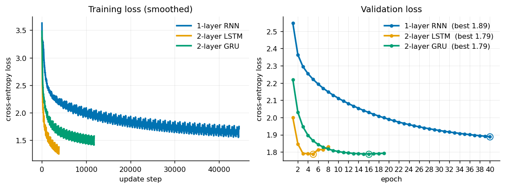
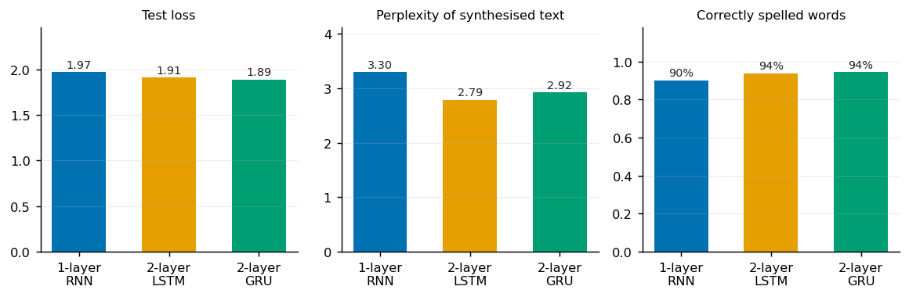

# Shakespearean text generation

[](https://github.com/Apolloden/RNN-project/actions/workflows/ci.yml)

Character-level text synthesis with recurrent neural networks: a vanilla RNN, LSTM and GRU trained on Shakespeare and Homer's *The Iliad*. Course project for DD2424 Deep Learning in Data Science at KTH Royal Institute of Technology.

<div>
    <a href="https://github.com/Apolloden" target="_blank">David Welzien</a>&emsp;
    <a href="https://github.com/Rick-cmy" target="_blank">Mingyang Chen</a>&emsp;
    <a href="https://github.com/Zhoukkkkkkk" target="_blank">Qianyu Zhou</a>&emsp;
    <a href="https://github.com/yxio11" target="_blank">Yuhui Xue</a>&emsp;
</div>



## Overview

The three architectures share one model: a stack of recurrent layers followed by a linear projection to the vocabulary. Characters are one-hot encoded on the fly, so the network sees raw characters rather than a learned embedding. Text is synthesised one character at a time with temperature scaling and optional nucleus (top-p) sampling, and is scored with perplexity, spelling accuracy, self-BLEU and BERTScore.

The full study (hyperparameter search, ablations, deeper models and the mixed-domain experiment) is written up in [report.pdf](report.pdf).

## Results

Produced by `python -m rnn.train --config configs/<model>.yaml` on `data/shakes.txt`, on an Apple M-series GPU. Perplexity, spelling accuracy and self-BLEU are measured on five 1000-character samples synthesised at temperature 0.5; test loss is the cross-entropy on the held-out 15%.

| Model | Best epoch | Val loss | Test loss | Perplexity | Spelling | Self-BLEU | Train time |
| --- | --- | --- | --- | --- | --- | --- | --- |
| 1-layer RNN | 40 | 1.89 | 1.97 | 3.30 | 90% | 0.03 | 14.1 min |
| 2-layer LSTM | 5 | 1.79 | 1.91 | 2.79 | 94% | 0.12 | 1.8 min |
| 2-layer GRU | 16 | 1.79 | 1.89 | 2.92 | 94% | 0.05 | 16.6 min |



An LSTM sample (`results/lstm/samples.txt`, temperature 0.5):

```
ROMEO: the great of a child: so heavens thing the cut of limits, and by the prince of the received
The matter being son what is the great powers
To say my lord, here he have so approach to she hath been you she does and see her to the since and the officeres,
And the servant: she doing with perpetual heart. Why, there I wish the master,
And the bear of the king's need to the belly the county and stay and the princess, she she's your perpetual
```

Each model lands close to its counterpart in the report: the RNN 0.03 above the reported 1.94, the 2-layer LSTM 0.02 above 1.89, and the GRU 0.01 above 1.88. The LSTM and GRU stop early, at epochs 5 and 16, while the RNN's validation loss is still falling when it reaches its 40-epoch budget, so it is the one model here that is not trained to convergence. The report's conclusion holds on these runs: the gap between a vanilla RNN and the gated architectures is smaller than the difference in complexity suggests, and the synthesised text is hard to tell apart by eye.

### Cost

| Model | Parameters | Update steps | Tokens | TFLOPs | Minutes | TFLOPs/min |
| --- | --- | --- | --- | --- | --- | --- |
| 1-layer RNN | 134,093 | 44,600 | 31.2M | 25.0 | 14.1 | 1.8 |
| 2-layer LSTM | 4,177,793 | 3,896 | 6.2M | 155.9 | 1.8 | 85.2 |
| 2-layer GRU | 228,730 | 11,856 | 14.8M | 20.2 | 16.6 | 1.2 |

FLOPs are estimated from the gate matrices and the output projection, with the backward pass counted as twice the forward pass; see `training_flops` in [models.py](src/rnn/models.py).

Two things stand out. The LSTM buys its 0.06 lower test loss with 31 times the parameters of the RNN, which is a poor trade if size matters to you. And FLOPs are a bad predictor of wall-clock time here: the LSTM does roughly eight times the arithmetic of the GRU yet finishes nine times sooner, because what costs time is the number of sequential update steps, not the arithmetic. Its batch of 64 sequences through 576-unit layers keeps the GPU busy at 85 TFLOPs/min, while the GRU's 145-unit layers leave it idle at 1.2. Widening the batch or the hidden size is close to free on this hardware; adding update steps is not.

## Setup

```bash
python -m venv .venv && source .venv/bin/activate
pip install -r requirements.txt      # installs the rnn package from src/ in editable mode
python scripts/download_data.py      # writes data/shakes.txt, data/illiad.txt, data/shakes_illiad.txt
```

Requires Python 3.10+. Training uses CUDA or Apple MPS when available and falls back to CPU.

## Training

```bash
python -m rnn.train --config configs/rnn.yaml
python -m rnn.train --config configs/lstm.yaml
python -m rnn.train --config configs/gru.yaml
```

Each run writes `results/<name>/` containing `history.json` (loss curves), `metrics.json`, `samples.txt` (synthesised text) and `model.pt` (the weights with the lowest validation loss). Useful flags:

| Flag | Effect |
| --- | --- |
| `--epochs N` | override the epoch budget in the config |
| `--limit-chars N` | train on the first N characters only, for a quick smoke run |
| `--device cpu` | force a device instead of auto-detecting |
| `--out DIR` | write artefacts somewhere other than `results/` |
| `--bertscore` | also compute BERTScore (downloads BERT weights on first use) |

A half-minute end-to-end check:

```bash
python -m rnn.train --config configs/lstm.yaml --epochs 1 --limit-chars 20000
```

The configs hold the hyperparameters found by the coarse-to-fine random search in the report (§5.2): hidden size, batch size and learning rate per architecture, sequence length 25, a 70/15/15 split, Adam, and early stopping after 3 epochs without a better validation loss. The RNN gets a larger epoch budget than the gated models because its learning rate is an order of magnitude smaller. Set `num_layers: 1` in `configs/lstm.yaml` for the 1-layer LSTM, raise `dropout` for the deeper variants discussed in the report, or point `data:` at `data/shakes_illiad.txt` for the mixed-domain run.

## Hyperparameter search

```bash
python scripts/hparam_search.py                            # all three, 10 trials each
python scripts/hparam_search.py --models lstm --trials 20  # one architecture
python scripts/hparam_search.py --lr-range 0.002 0.006     # fine search around a coarse winner
```

Random search over hidden size, batch size, number of layers and a log-uniform learning rate, starting from each architecture's config. It measures validation loss only (no sampling, no metrics, no checkpoints) and gives every trial a short budget (`--epochs 5`, `--patience 2`) so that bad configurations are abandoned quickly. The corpus is encoded once and the datasets are shared across trials and architectures, which is where the old per-trial rebuild spent most of its time. Rankings land in `results/search/<model>.json`; the winning values belong in `configs/<model>.yaml`.

## Figures

[`notebooks/analysis.ipynb`](notebooks/analysis.ipynb) rebuilds both figures above, plus the two tables, from the JSON in `results/`. It is the only notebook in the repository: analysis lives in the notebook, training lives in `src/rnn/train.py`.

## Tests

```bash
pytest
```

Covers the vocabulary, the sequence construction and splits, forward passes and state handling for all three cell types, nucleus sampling, parameter and FLOP counting, and the metrics. CI runs the tests and a one-epoch training run on every push.

## Layout

```
.github/workflows/ci.yml   tests + a smoke training run
src/rnn/
    data.py                corpus loading, character vocabulary, train/val/test split
    models.py              CharRNN (cell_type in {rnn, lstm, gru}), nucleus sampling, generation
    metrics.py             perplexity, spelling accuracy, self-BLEU, BERTScore
    train.py               CLI entry point
configs/                   one YAML per architecture
notebooks/analysis.ipynb   figures
scripts/download_data.py   fetches and verifies the corpora
scripts/hparam_search.py   random search over one or all architectures
tests/                     unit tests
results/                   run artefacts and figures
```

## Data

`scripts/download_data.py` fetches the two corpora and checks them against pinned SHA-256 digests. Shakespeare is the `tiny-shakespeare` file distributed by TensorFlow (1.1M characters); *The Iliad* is Project Gutenberg ebook 6130, with the licence header, footer and table of contents stripped (1.1M characters). `shakes_illiad.txt` is the concatenation of the two and is used for the mixed-domain experiment. The corpora are not committed; `data/` is git-ignored. Note that Project Gutenberg re-releases ebooks from time to time, so the *Iliad* copy used while writing the report is not byte-identical to the one the script downloads today.

## Contributions

| Author | Focus |
| --- | --- |
| [David Welzien](https://github.com/Apolloden) | Character encoding, model architectures and text synthesis |
| [Mingyang Chen](https://github.com/Rick-cmy) | Nucleus sampling and temperature scaling |
| [Qianyu Zhou](https://github.com/Zhoukkkkkkk) | Hyperparameter search and ablations |
| [Yuhui Xue](https://github.com/yxio11) | Evaluation metrics and analysis |

## License

[MIT](LICENSE)
